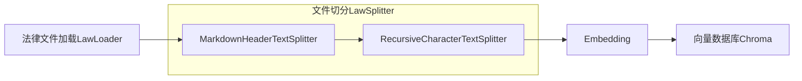
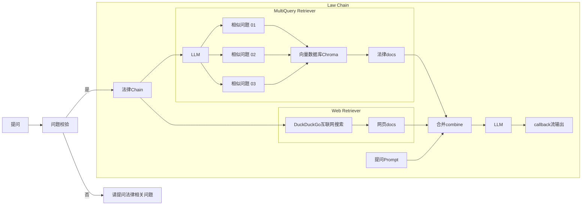

<div align="center">

# 🎉 项目修改记录（2025-12-05）

**修改者**: Kshqsz  
**修改日期**: 2025年12月5日  
**修改目的**: 将原项目从 OpenAI API 迁移到阿里云 DashScope（Qwen）API

</div>

---

## ✅ 主要修改内容

### 1. API 适配修改
- **LLM 模型**: 从 `gpt-3.5-turbo` 改为 `qwen-max`（通过阿里云 DashScope OpenAI 兼容接口）
- **Embedding 模型**: 自定义实现 `DashScopeEmbeddings` 类，使用阿里云原生 `text-embedding-v2` 模型

### 2. 修改的文件
| 文件 | 修改内容 |
|------|----------|
| `law_ai/utils.py` | 新增 `DashScopeEmbeddings` 类，修改 `get_model()` 和 `get_embedding_model()` 函数 |
| `.env` | 配置阿里云 DashScope API Key 和模型参数 |

### 3. `.env` 配置示例
```env
# LLM 配置
OPENAI_API_KEY=sk-你的阿里云DashScope-API-Key
OPENAI_BASE_URL=https://dashscope.aliyuncs.com/compatible-mode/v1
MODEL_NAME=qwen-max

# Embedding 配置
EMBEDDING_MODEL=text-embedding-v2
```

---

## ⚠️ 遇到的问题及解决方案

### 问题 1: OpenAI 兼容层 Embedding 调用失败
**错误信息**: `InvalidRequestError: Value error, contents is neither str nor list of str`

**原因**: 旧版 `langchain` (0.1.x) 使用的 `openai` 库 (0.28.x) 与阿里云 DashScope 的 OpenAI 兼容接口不完全兼容。

**解决方案**: 使用阿里云官方 `dashscope` SDK，自定义实现 `DashScopeEmbeddings` 类，彻底绕过兼容性问题。

### 问题 2: pyenv 与虚拟环境冲突
**现象**: `source venv311/bin/activate` 后，`python` 命令仍指向 pyenv 的版本。

**原因**: pyenv 的 shims 路径优先级高于虚拟环境。

**解决方案**: 移除 pyenv，直接使用 Homebrew 安装的 Python 3.11 创建虚拟环境。

### 问题 3: 向量数据库需要重新初始化
**注意**: 更换 Embedding 模型后，必须删除旧的向量数据库并重新初始化！
```bash
rm -rf chroma_db/ .cache/embeddings/
python manager.py --init
```

---

## 🚀 运行结果
- ✅ 向量数据库初始化成功，共导入 **21288** 个法律条文片段
- ✅ Web UI 运行正常
- ✅ 法律问答功能正常

---

<div align="center">
  

[](https://www.gradio.app/)
[](https://twitter.com/billvsme)

</div>

法律AI助手
=========

法律AI助手，法律RAG，通过倒入全部200+本法律手册、网页搜索内容结合LLM回答你的问题，并且给出对应的法规和网站，基于langchain，openai，chroma，duckduckgo-search, Gradio

## Demo
[https://law.vmaig.com/](https://law.vmaig.com/)

**用户名**: username  
**密码**:  password  

## 原理

基于langchain链式调用，先按条切分法律条文，导入向量数据Chroma。
问答相关问题时，先通过相似度搜索向量数据，获取相关法律条文，然后通过DuckDuckGo互联网搜索相关网页，然后合并法律条文和网页内容，对问题进行回答。

**初始化init**


**提问流程**



## 初始化运行环境

```
# 创建.env 文件
cp .env.example .env

# 修改.env 中的内容
vim .env

# 安装venv环境
python -m venv ~/.venv/law
. ~/.venv/law
pip install -r requirements.txt
```

## 初始化向量数据库

```
# 加载和切分法律手册，初始化向量数据库
python manager.py --init
```

## 运行web ui

```
python manager.py --web
```

默认用户名/密码: username / password

<a href="https://sm.ms/image/DbP3TiHZConUFe7" target="_blank"></a>

## 运行对话

```
python manager.py --shell
```

<a href="https://sm.ms/image/7E4zMpbafCPvNxX" target="_blank"></a>

## 配置修改

如果你想修改回答中的法律条数和网页条数，可以修改config.py
- 法律条数: LAW_VS_SEARCH_K
- 网页条数: WEB_VS_SEARCH_K
- web ui地址: WEB_HOST
- web ui端口: WEB_PORT
- web ui登录用户: WEB_USERNAME
- web ui登录密码: WEB_PASSWORD
